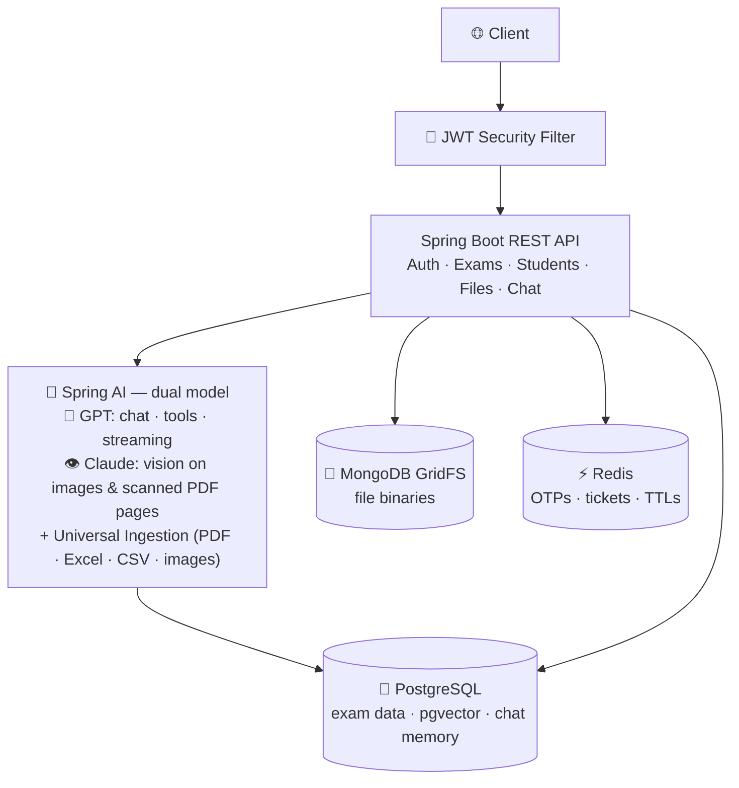
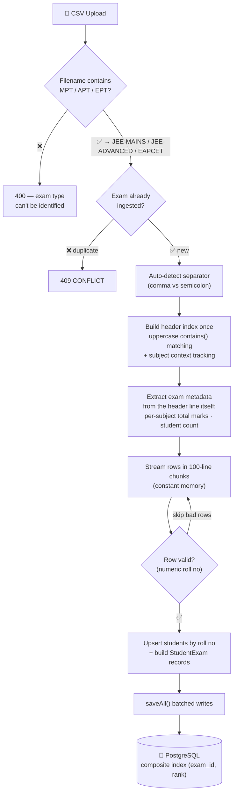
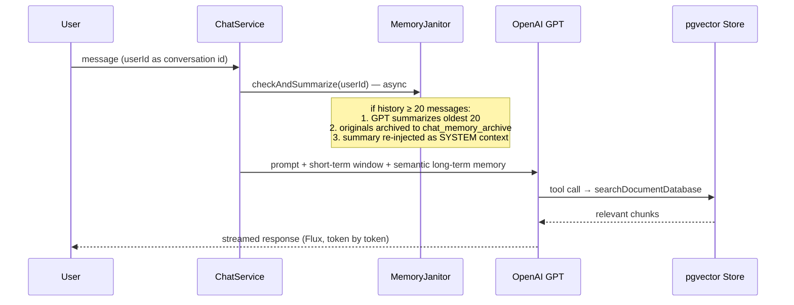
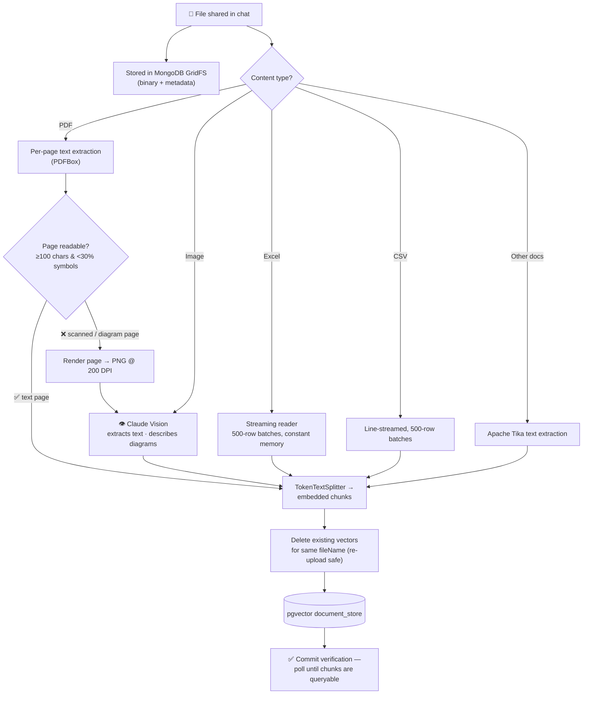
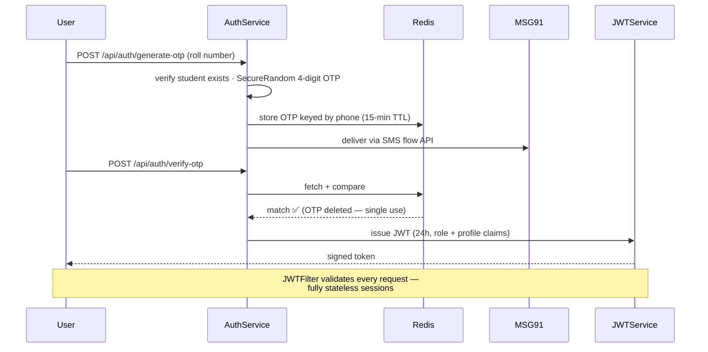

# 🎓 ScoreLens — Student Exam Results Platform with a Multimodal AI Support Chatbot

> A Spring Boot 3 backend that turns raw exam-result CSVs into a fast, queryable leaderboard database — paired with a **dual-model AI assistant** (GPT for chat orchestration, Claude for vision) that tutors students, answers questions about their own results, and genuinely *understands* any file or image shared with it.


---

## ✨ What This Project Does

The platform has **two core sections**:

### 1️⃣ Exam Results Upload (CSV → PostgreSQL)
Admins upload real-world exam result CSVs — the messy kind, with subject sections, embedded numbers in headers, duplicate `RANK` columns, and inconsistent separators. A deterministic streaming parser normalizes everything and bulk-loads students and per-subject results into PostgreSQL, ready for paginated, filterable leaderboards and subject-wise topper rankings.

### 2️⃣ AI Support Chatbot (Tutoring + True File/Image Understanding)
A support assistant built on **Spring AI** with a deliberate **dual-model design**: OpenAI GPT orchestrates conversations (streaming, tool calling, structured outputs), while **Anthropic Claude provides vision** — reading images and even *rendered PDF pages* when plain text extraction isn't enough. The bot acts as a tutor: general concepts are explained from model knowledge, but questions about a student's own marks or documents are answered through **function-calling tools** grounded in real data. Everything a user shares is chunked, embedded, and stored in **pgvector** for retrieval, and conversation memory is managed by a **three-tier architecture** including an LLM-powered rolling summarizer.

> **Note the distinction:** the exam-results pipeline accepts **CSV only** and writes structured rows to PostgreSQL, while the chatbot's universal ingestion accepts **any format — including CSV** — purely so the AI can read and discuss the content.

Rounding it out: **SMS OTP + stateless JWT authentication**, role-based access, GridFS file storage, and one-time-ticket secured streaming downloads.

---

## 🏗️ High-Level Architecture



*(Each API domain is a controller + service pair — e.g. "Files" is `FileController` → `FileService`; see [Project Structure](#%EF%B8%8F-project-structure) for the full class layout. The deep-dive diagrams below show each flow in detail.)*

**Why three databases?** Each store does what it's best at. **PostgreSQL** holds relational exam data *and* doubles as the vector store (pgvector) and chat memory — fewer moving parts, transactional guarantees. **MongoDB GridFS** stores the actual uploaded file binaries with rich metadata and role-scoped access. **Redis** holds short-lived state — OTPs (15-min TTL), one-time download tickets (30-sec TTL), and download statuses (10-min TTL) — expiring automatically instead of requiring cleanup jobs.

---

## 1️⃣ Exam Results Pipeline — Deterministic CSV Parsing at Scale



**Engineering highlights:**

- **Subject context tracking** — real result sheets repeat ambiguous headers like `RANK` four times (Physics, Maths, Chemistry, Total). The parser tracks which *subject section* it's currently in while walking the header row, so each `RANK` lands in the right field. This deterministic approach was chosen after benchmarking an LLM-based semantic parser for the same job — deterministic won on speed, cost, and reliability.
- **Metadata mined from headers** — per-subject total marks and total student count are embedded *inside* header text (e.g. a rank column carrying the cohort size); the parser extracts them with targeted numeric scanning and stores them on the `Exam` entity.
- **Streaming + chunking** — the file is read line-by-line and parsed in 100-row chunks, so memory stays flat regardless of file size.
- **Resilient by design** — separator auto-detection (`,` vs `;`), tolerant `contains()`-based header matching, null-safe typed field extraction, and per-row validation (non-numeric roll numbers are skipped and logged, never crash the ingest).
- **Idempotent-ish loading** — students are upserted by roll number across uploads, so the same student appearing in multiple exams maps to one record.
- **Fast reads after write** — leaderboard queries are paginated, filterable (roll no / city / name), rank-sorted, and backed by a composite index on `(exam_id, rank)` with Hibernate batch configuration on the write path.
- **Subject-wise toppers** — dedicated queries surface top rankers overall *and* per subject (Physics / Maths / Chemistry), either across all exams or scoped to a single exam.

### 📋 CSV Requirements

| Rule | Detail |
|---|---|
| **File name** | Must contain the exam code: `MPT` (JEE-MAINS), `APT` (JEE-ADVANCED), or `EPT` (EAPCET) — this identifies the exam type. The filename (minus extension) becomes the unique exam identifier. |
| **One upload per exam** | Re-uploading an already-ingested exam returns `409 CONFLICT`. |
| **Header row** | First line. Recognized loosely by keywords — e.g. columns containing `ID NO`, `STUDENT NAME`, `CENTRE`, `PHONE`, `CITY`, `CLASS`, and per-subject sections (`PHYSICS…`, `MATHS…`, `CHEMISTRY…`, `TOTAL…`) with fields like attempted/correct/wrong questions, positive/negative marks, marks scored, time spent, and `RANK`. Exact casing and extra text don't matter. |
| **Separator** | Comma or semicolon — detected automatically. |
| **Rows** | Each data row needs a numeric roll number; invalid rows are skipped and logged rather than failing the upload. |

---

## 2️⃣ AI Support Chatbot

### Chat Flow — Streaming, Tools, and Self-Managing Memory



- **Three-tier memory architecture** — (1) a 20-message JDBC-backed sliding window for short-term context, (2) a `VectorStoreChatMemoryAdvisor` that gives the model *semantic long-term recall* over past conversations via pgvector, and (3) a rolling summarizer: an async janitor detects when a conversation crosses 20 messages, has the LLM **summarize the oldest 20**, archives the originals to a separate table, and re-injects the summary as system context. The history endpoint transparently `UNION`s live memory with the archive, so users always see their full conversation.
- **Tutor persona with guarded tool use** — the system prompt shapes the bot as a student tutor: general concepts answered from model knowledge, but anything about *the user's own marks, papers, or documents* must go through tools like `searchDocumentDatabase`, with explicit anti-looping rules for graceful degradation when a tool finds nothing.
- **Streaming responses** — token-by-token delivery via Reactor `Flux` over Server-Sent Events, plus a structured-output mode that maps model responses directly onto typed Java objects.

### File & Image Understanding — the Hybrid Ingestion Pipeline



- **Hybrid PDF processing** — each page is tried as text first (fast, cheap); a *gibberish heuristic* (too short, or >30% special characters) detects scanned or diagram-heavy pages and escalates **only those pages** to Claude Vision on a 200-DPI render. Best of both: speed on clean pages, real understanding on visual ones.
- **True image understanding** — screenshots and photos go straight to Claude Vision, which extracts text and describes diagrams before embedding.
- **Constant-memory spreadsheets** — Excel is read with a streaming reader and both Excel and CSV are ingested in 500-row batches, so large files never blow the heap.
- **Re-upload safe** — existing vectors for the same filename are deleted before insert, and deleting a chat file removes both its GridFS binary and its vectors.
- **Read-your-writes guarantee** — after ingestion, the service polls the vector store until the new chunks are actually queryable, so the model can discuss a file *immediately* after upload.

---

## 🔐 Authentication — SMS OTP + Stateless JWT



- **Roll-number-first login** — students authenticate with their roll number; the OTP goes only to the phone on record, so credentials can't be redirected.
- **Single-use, self-expiring OTPs** — stored in Redis with a 15-minute TTL, deleted on successful verification, and cryptographically generated with `SecureRandom`.
- **Role-aware everywhere** — the JWT carries the role claim, mapped to Spring Security authorities; e.g. the student directory is admin-only, and file listings are automatically scoped to the requester's own uploads unless they're an admin.
- **DB-verified tokens** — the `JWTFilter` doesn't just validate signatures; it re-checks the student still exists before granting authority, so deleted accounts lose access immediately despite stateless sessions.
- **Async-aware security** — the security context uses `MODE_INHERITABLETHREADLOCAL`, so the `@Async` memory janitor thread inherits the caller's authentication instead of running unauthenticated.
- **Testing bypass flag** — per-student `smsOtpByPass` allows demo/test logins without burning SMS credits.

---

## 📦 Secure File Downloads — One-Time Tickets

Downloads from GridFS are guarded by a **ticket pattern**: the client first requests a ticket (authenticated) for a specific file, then redeems it. Tickets are single-use (deleted on redemption), bound to one file id, and **expire in 30 seconds** via Redis TTL — a leaked ticket is worthless almost immediately. The download endpoint itself is deliberately outside JWT protection: **the ticket is the credential**, which lets browsers trigger native downloads from a plain link (where attaching an `Authorization` header isn't possible) without ever leaving the endpoint open. The download is **streamed** in 8KB chunks via `StreamingResponseBody` with live status tracking (`PENDING → COMPLETED / FAILED`, self-expiring after 10 minutes) — large files never buffer in memory or block threads unnecessarily.

---

## ⚡ Performance & Reliability Engineering

| Concern | Solution |
|---|---|
| Rank-ordered leaderboard queries | Composite index on `(exam_id, rank)` + pagination |
| Filtered lookups | Dedicated indexes on roll no, name, city (Student) and identifier, type (Exam) |
| ID generation during bulk inserts | Sequence generators with `allocationSize = 100` — IDs fetched in blocks, not per row |
| Bulk CSV inserts | Chunked parsing + `saveAll()` with Hibernate batch configuration |
| Large Excel/CSV uploads in chat | Streaming readers, 500-row batches — constant memory |
| Unbounded chat memory growth | LLM rolling summarization + archive table |
| Vision API cost on PDFs | Text-first per page; vision only for pages that need it |
| Duplicate ingestion | Exam-level `409` guard; vector-level delete-before-insert |
| Read-after-write on embeddings | Commit verification polling before responding |
| Large file downloads | One-time tickets (30s TTL) + 8KB streaming + status tracking |
| Short-lived state cleanup | Redis TTLs on OTPs, tickets, and statuses — no cleanup jobs needed |

---

## 🔌 API Overview

| Endpoint | Method | Purpose |
|---|---|---|
| `/api/auth/generate-otp` | POST | Send login OTP to the student's registered phone |
| `/api/auth/verify-otp` | POST | Verify OTP → returns JWT |
| `/api/exams` | GET | List exams, filterable by type / identifier |
| `/api/exams/{examId}` | GET | Paginated leaderboard — filter by roll no, city, or name |
| `/api/students` | GET | Student directory (admin-only), paginated + filterable |
| `/api/students/{id}/report` | GET | A student's results across all exams |
| `/api/students` · `/{id}` | POST / PUT / PATCH | Create and manage student records |
| `/api/file/bulk-update` | POST | **The exam results pipeline** — upload a result CSV for full ingestion |
| `/api/file/upload` | POST | Store a file in GridFS |
| `/api/file` | GET | List files (role-scoped: admins see all, students see their own) |
| `/api/file/generate-ticket/{fileId}` | GET | Issue a 30-second one-time download ticket |
| `/api/file/download/{id}?ticket=` | GET | Redeem ticket → streamed download |
| `/api/file/download/status/{id}` | GET | Poll download status |
| `/api/chat/{userId}/stream-chat` | POST | **The chatbot** — SSE token-by-token streaming responses |
| `/api/chat/{userId}/block-chat` | GET | Non-streaming chat with structured (typed) response |
| `/api/chat/{userId}/chat-history` | GET | Full history — live memory ∪ summarized archive |
| `/api/chat/upload` | POST | Share a file/image with the chatbot (GridFS + vector ingestion) |
| `/api/chat/delete/{fileId}` | DELETE | Remove a chat file — deletes both binary and its vectors |

---

## 🗂️ Project Structure

```
src/main/java/org/example/studentdashboard/
├── Config/          # SecurityConfig, JWTFilter, AIConfig (dual clients + advisors), MongoConfig
├── Controller/      # Auth, Student, Exam, File, Chat endpoints
├── Service/         # FileService (CSV + GridFS + tickets), ChatService,
│                    # UniversalIngestionService, MemoryJanitorService,
│                    # AuthService, JWTService, SMSService, ExamService, StudentService
├── Repositories/    # Spring Data JPA + Redis repositories
├── Models/          # Entities & DTOs (Student, Exam, StudentExam, OmrFile, Ticket…)
├── CSVModels/       # CSV parsing models (StudentData, ExamResults)
├── Tools/           # Spring AI function-calling tools (searchDocumentDatabase…)
└── Enums/           # Role
```

---

## 🛠️ Tech Stack

| Layer | Technology |
|---|---|
| Framework | Spring Boot 3.4.1 (Java 17) · Spring Web + WebFlux (SSE streaming) |
| AI | Spring AI 1.0.3 · OpenAI (chat/tools) · Anthropic Claude (vision) · pgvector RAG · JDBC chat memory + advisors |
| Databases | PostgreSQL + JPA/Hibernate · MongoDB GridFS · Redis |
| Security | Spring Security · JWT (jjwt) · SMS OTP (MSG91) |
| File Processing | PDFBox (text + rendering) · Apache POI + streaming reader · Apache Tika |
| Build | Maven (wrapper included) |

---

## 🚀 Getting Started

```bash
# 1. Clone
git clone https://github.com/Premanshu-jha/OMR.git && cd OMR

# 2. Configure (src/main/resources/application.properties)
#    - PostgreSQL (with pgvector extension), MongoDB, Redis
#    - OpenAI + Anthropic API keys
#    - SECRET_KEY (base64) for JWT signing
#    - MSG91 auth key + template id for SMS OTPs

# 3. Run
./mvnw spring-boot:run
```

---

## 📌 Key Takeaways

- **Two purpose-built pipelines** — a deterministic, streaming CSV→PostgreSQL results path, and a multimodal AI chat path — each engineered for its actual job
- **Dual-model AI architecture** — GPT where conversation and tools shine, Claude where vision shines, glued together by Spring AI's abstractions
- **Three-tier self-managing memory** — sliding window + semantic long-term recall + LLM-summarized archive
- **Cost-aware vision** — the hybrid PDF pipeline pays for vision only on the pages that need it
- **Thoughtful security patterns** — single-use expiring OTPs, DB-verified stateless JWTs, and ticket-as-credential downloads
- Real **polyglot persistence** with a clear reason for every store, and measurable performance work throughout
